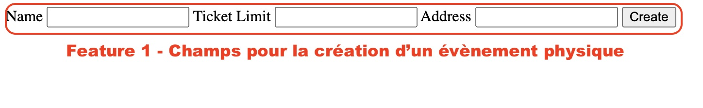

# Feature 1 - _Réservation pour événement physique_

## Description 

- Cette feature permet la réservation pour les événement physique.

## Variabilité
- Cette Feature ne peut pas être implémenté en même temps que la Feature 2
- Cette Feature Implique obligatoirement la Feature 8
- Cette Feature peut engendrer la Feature 7

## Ajout dans le produit

## Composition

- Une classe `entity/PhysicalEvent.php` qui hérite de `Event.php` du module core.
- Un formulaire de création d'événement physique `template/formPhysicalEvent.phtml`
