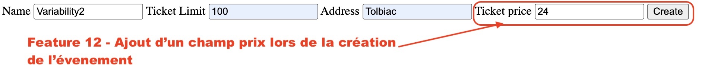
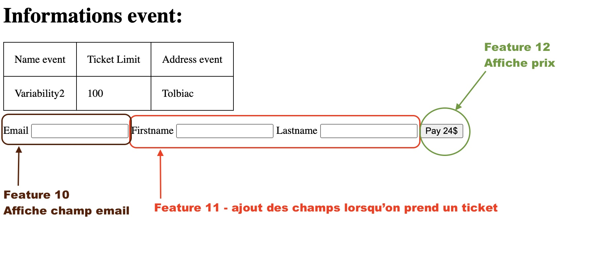

# Feature 12 - _Paiement en ligne_

## Description 

Cette feature permet que les billets soient à payer en ligne au moment de la réservation

## Variabilité

- Cette Feature optionnel ne necessite que le core

## Ajout dans le produit
lors de la creation de l'événement

lors de la reservation d'une place

## Composition

- Une formulaire `template/formPlacePrice.phtml` qui demande le prix de la place à la creation de l'événement.
