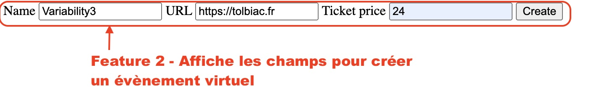

# Feature 2 - _Réservation pour événement en ligne_

## Description 

Cette feature permet de créer des événements en ligne.

## Variabilité

- Cette Feature ne peut pas être implémenté en même temps que la Feature 1
- Cette Feature peut engendrer la Feature 3
- Cette Feature peut engendrer la Feature 4
- Cette Feature peut engendrer la Feature 5

## Ajout dans le produit

## Composition

- Une classe `entity/VirtualEvent.php` qui hérite de `Event.php` du module core.
- Une classe `entity/Invitation.php` qui hérite de `Participation` du module core.
- Un formulaire de création d'événement en ligne `template/formVirtualEvent.phtml`
- Un formulaire de création d'invitation `template/formInvitation.phtml`
