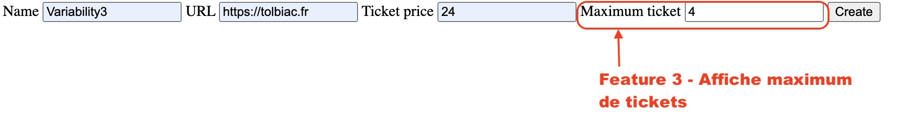
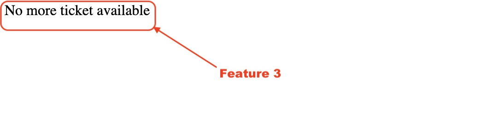

# Feature 3 - _Limitation du nombre de places_

## Description 

Cette feature permet de fixer une limite de place pour un événement en ligne.

## Variabilité

- Cette Feature necessite l'implémentation de la Feature 2

## Ajout dans le produit
lors de la creation d'un evenement

lorsqu'il n'y a plus de place disponible pour l'événement.

## Composition

- Un formulaire `template/formLimitTicket.phtml` qui demande le nombre de places maximum.
