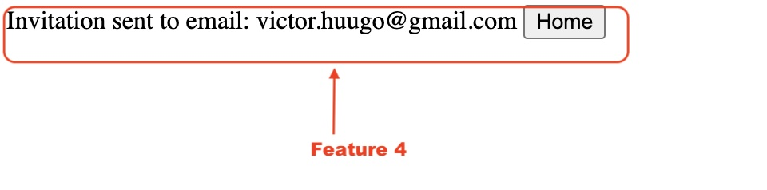

# Feature 4 - _Envoi des invitations_

## Description 

Cette feature permet l'envoi d'invitation avec un lien (zoom,teams, meats, plateforme externe) pour suivre un événement en direct

## Variabilité

- Cette Feature necessite l'implémentation de la Feature 2

## Ajout dans le produit

## Composition

- Un controlleur `controller/InvitationController.php` qui gere l'envoie de mail.
