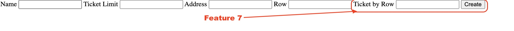

# Feature 7 -  _Attribution de place_

## Description 

Grace a cette feature, les places sont attribuées à l'avance pour les événements physiques. contrairement au produit de base qui sont en placement libre

## Variabilité

- Cette Feature est optionnel et necessite l'implémentation de la Feature 1

## Ajout dans le produit

## Composition

- Un entité `entity/TicketAttributateEvent.php` qui herite de `PhysicalEvent.php` du module feature1.
- Un formulaire `template/formTicketAttributateEvent.phtml` qui demande le nombre de rangée et de place par rangée en plus lors de la création de l'événement.
