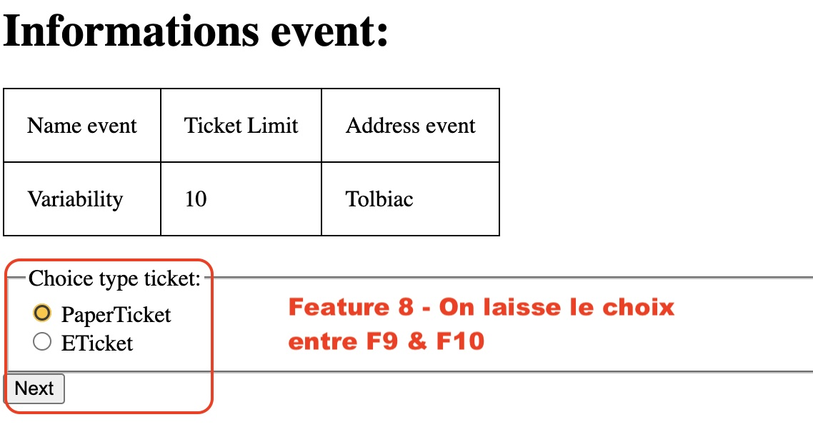

# Feature 8 -  _Envoi des billets_

## Description 

Cette Feature permet la gestion de l'envoi des billets pour les événements physique en imposant ou en laissant le type de ticket qu'un utilisateur recevra.

## Variabilité

- Cette Feature necessite l'implémentation de la Feature 1 et est obligatoire des lors que cette derniere est implémentée 
- Cette Feature implique de choisir d'implementer au moins une des deux Features 9 et 10

## Ajout dans le produit

## Composition

- Un entité `entity/Ticket.php` qui herite de `Participation.php`du module core.
- Un formulaire `template/choice.phtml` qui permet de donner le choix à l'utilisateur sur le type de billet qu'il recevra.
- Un formulaire `template/formTicket.phtml` qui sera utiliser pour créer un ticket.
